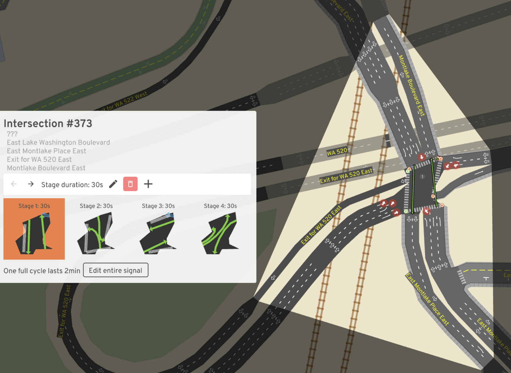

# Applying simulation inference to city planning tools
Samuel Griesemer\
samgriesemer@usc.edu
University of Southern California

Jared Hwang\
jaredhwa@usc.edu\
University of Southern California

## Abstract
The way cities are structured and designed can have a massive impact on everything ranging
from human health, to climate change, to societal equity. Understanding the relationship
between a city's features to these qualities is paramount to designing cities according to
our goals as a society. Simulation-based inference is a method in which a simulator is
described by a joint distribution over some output of a simulation and some latent
variables, conditioned on some input. We thereby can attempt to directly learn the
relationship between the output and the input parameters. We apply this technique to A/B
Street, a traffic simulation tool, by investigating the impact of one intersection's
traffic light timing on the average trip time in the wider area. We find that, when
applied to simulations run in the Montlake area of Seattle, that there is a meaningful
relationship between the traffic stage timing and the average trip time in the area.
Namely, shortening or lengthening traffic stage times corresponds with a higher
probability of shorter or longer trip times respectively. We hope that these preliminary
results show that for the urban planning field, simulation inference is a powerful tool
that is applicable in many cases.

## Background
City and infrastructure design is only becoming more crucial as we as a society become
more cognizant of out impact on climate change, public health, and racial and
socio-economic equity. It is widely understood that the structural design of our cities
have a marked impact on our wellbeing both individually and collectively, so it is
therefore in our best interest to design and propose policy that actively strives towards
"better" cities.

However, a major impedance of this goal is the number of conflating factors and differing
goals (politically and technically) when considering optimal design. Each can have
innumerable differences from another: their geographic topology, climate, socio-economic
and race composition, historical features, and so on. 

As a result, a deeper understanding of a city's design on its residents, resource usage,
and so on, is extremely desirable to motivate better policy and design recommendations,
but correspondingly can be difficult to pin down. 

To approach this problem, we attempt to apply an inference technique developed by
Papamakarios and Murray [[1, 2]](#1) on A/B Street, a road/city planning simulation
[[3]](#3), as a proof-of-concept application of simulation inference on city planning
simulations to broadly learn the impacts of traffic and road design on the efficiency and
resource use of a city.

## Method

### Simulation-based inference
Simulators are formally treated as probabilistic programs that take a vector of parameters
θ as input, internally sample a series of latent states zi ~ pi
(zi | θ, z < i ), and produce a data vector x ~ p(x | θ, z) as
output. As such, simulators can be described by the joint distribution p(x, z | θ) over
the output x and latent variables z. This distribution captures the relative likelihoods
of (x,z) pairs under fixed parameter values, embracing the relationship between θ and z
explicitly. Note that this can be written as the product 

p(x, z | θ) = p(x | z, θ) p(z | θ)

This expansion involves the distributions seen in the two-step sampling procedure of the
simulator definition: p(z | θ)
 to produce latent variables from the input parameters,
and p(x | z, θ) to yield the final output vector given the inputs and latents. The
likelihood function p(x | θ) implicitly defined by the simulator can then be seen as
a marginalization of this form with respect to the latent variables:

p(x|θ) = ∫ p(x,z|θ)dz

Note that this integral depends on all possible trajectories through the latent space.
That is, for a given value of x, evaluating the likelihood at that value depends on all
possible combinations of internal simulator states that could possibly lead to x as the
simulator's output. For sufficiently complex latent spaces, this integral becomes
intractable. Unfortunately, this is the case in most real-world settings, and where
likelihood-free inference is employed.

 Simulation-based inference diagram.

{width=50%} Sequential neural posterior estimation
diagram

### Simulator: A/B Street
A/B Street is a city and traffic simulator developed by Dustin Carlino, built using the
Open Street Map (OSM) format [[4]](#4). It is widely flexible and supports importing any
map through OSM, changing lane type (driving, bus, bike) and speed limits, traffic light
timings, among others. It also has built in visualization, data aggregation, and an API
through which we can control the simulation headlessly via Python code. We chose A/B
Street due to these factors, contributing to its ease of using it as a black box for the
simulation inference. 

Traffic Simulation run in A/B Street

Editing roads in the A/B Street GUI

Understanding simulation output

## Software Requirements
To run the code, download the A/B street repository (abstreet.org) and its requirements
and follow the instructions there to start a server headlessly with the desired map. Then,
run the Python code provided in this repository.

Alternatively, use the provided Singularity environment definition file to build a
container with the required packages, and simply run the headless Rust program in the A/B
Street repository to start the server, then run the Python code here. This is particularly
useful for running the inference on a high-performance cluster for faster results, as we
did using the University of Southern California Advanced Reserach Computing Cluster
(CARC). NOTE: currently the Singularity container does not quite work out of the box, due
to some permissions errors that require extra work before and after building the container
in order to have all the requisite software. This is a work in progress. 

## Expected Results
As discussed above, there are some traits of road structure that are already understood:
for example, increasing number of lanes doesn't necessarily decrease trip times. Using
simulation inference, we hope to gain deeper insight on the design of intersections and
intra-city roads on overall travel time and throughput, which may be counter-intuitive to
what we may expect.

## Experimental setup
As mentioned previously, our experiments are performed on the Montlake region within
Seattle. We use the A/B Street traffic simulator to gather observational data on typical
resident commutes within the area. The simulator explicitly models high-fidelity
interactions between simulated individuals; there are thousands of unique residents with
predetermined travel plans, and they must navigate the dynamic state of the road system as
dictated by all other individuals. Our overarching goal is to better understand the
dynamics of _traffic signal staging_ and how it impacts the average commute time for
residents. We focus explicitly on intersection #373 (as labeled by A/B street), pictured
below:

_(Intersection #373 and its stages, as shown in the A/B Street GUI)_

A/B Street admits a certain level of flexibility when it comes to modeling the behavior of
traffic signal stages. We focus on _variable staging_, where each stage's dynamics are
dictated by three parameters:

- θ1: the minimum delay (in seconds) at a stage. This is a fixed amount of time
  that certain lanes in the intersection will have the right to drive through (i.e. a green
  light).
- θ2: intervallic extensiom (in seconds) to minimum delay if vehicles are waiting
  at the signal. If there are no waiting vehicles, the stage ends.
- θ3: maximum total extension (in seconds) to minimum delay. Places a limit on
  the number of additional checks for waiting vehicles that can be made in a given stage.

We then formulate a uniform prior over these parameters in accordance with our initial
beliefs about reasonable values for effective throughput. Samples are drawn from this
prior to parametrize the traffic simulator, and we collect the resulting average travel
duration across the entire Montlake region. Note: each of the four stages (as shown in the
above diagram) have shared parameters for the selected intersection.

## Results
After collecting the simulated data, we train a masked autoregressive flow to directly
approximate the posterior p(θ | x). Here x∈ℝ, the average travel time (in seconds) of all
trips taken in the region within a 24 hour period. Note that each simulation run has a
deterministic set of trips to be taken by simulated individuals, allowing us to directly
compare travel times under different traffic signal behaviors. Drawing samples from the
posterior conditioned on travel times observed prior to any change (denoted xo) yields the
following plot:

 
_(Posterior over the three traffic signal parameters, conditioned on baseline travel
duration; p(θ | xo))_

The "dim 1", "dim 2", and "dim 3" labels in this plot (and similar plots below) correspond
to parameter values θ1, θ2, and θ3, respectively. This
plot shows signal staging parameter values that appear likely to yield similar travel
times to our baseline data (fixed stage timing at 30 seconds per stage) under the
simulator's implicit model. We observe parameter values in line with this baseline, namely
θ1 centered around 30-35 seconds.

We also condition the posterior on _smaller average travel times_ to reason about possible
parameter values that lend themselves to more efficient traffic flow. Conditioning on 4
seconds below the baseline:

_(Posterior over the three traffic signal parameters, conditioned on 4 seconds below baseline travel
duration; p(θ | xo-4s))_

Here we see a noticeable decrease in the mean of θ1, suggesting the shorter
stages can yield improved traffic throughput. Conditioning on even small traffic durations
(8 seconds below baseline), we see this trend continues:

 
_(Posterior over the three traffic signal parameters, conditioned on 8 seconds below baseline travel
duration; p(θ | xo-8s))_

Notice in this setting we also observe more probability mass centered around the mode of
marginal distributions for parameters θ2 and θ3. This suggests that
particular combinations of interval extension and maximum delay extension become more
impactful under tighter timing regimes. We also attempt to condition on travel times
shorter than any observed average duration (minimum was ~8.5 seconds below baseline):

 
_(Posterior over the three traffic signal parameters, conditioned on 10 seconds below baseline travel
duration; p(θ | xo-10s))_

This plot captures our model's generalized understanding of traffic dynamics just beyond
the training data; there are no empirical data in this setting for the model to pull from.
Here we see even shorter minimum stage delays, as well as shorter maximum extension times.
This aligns with our original intuition that shorter stage delays likely lead to greater
throughput, but it's clear the intervallic stage delays and extension times still play an
important role (i.e. they don't dissolve despite being supported under the prior).

## Future Goals
As stated above, we use A/B Street and traffic light staging as a preliminary
proof-of-concept on the application of simulation inference on city
design. However, there are many more ways we can utilize this technique
beyond just roads.

A burgeoning field is that of understanding city design on the emissions
produced by a city, and understanding how the block and road structure
impacts the city's contribution to climate change. Gim performed a global 
study of land-use on a various city's emissions, for example, congestion 
leading to longer trip times leading to greater emissions [[5]](#5).
By using a model and performing inference on it, we can potentially 
understand how to more granularly change current cities or motivate 
future cities to reduce resource use and CO2 emissions.

Relatedly is the concept of urban heat islands--when the city itself is
warmer than the surrounding areas, resulting in greater air-pollution and
heat-related illnesses, among others. Understanding how building material and block
structure impacts this could be of massive benefit. Gober et al. explored this 
for Phoenix, Arizona, by modeling three different scenarios based on gathered 
data [[6]](#6). We could potentially use simulation 
inference on their model to more fundamentally understand the land-use and heat island 
relationship.

Another area of interest is how policy changes can influence land-use in certain 
areas, thereby influencing everything about the city itself--from emissions to all 
the other qualities discussed above. Landis investigated this using their California 
Urban Futures Model, where they simulated the results of three different scenarios: 
"business as usual", "Maximum Environmental Protection", and "Compact Cities" [[7]](#7).
 By applying inference on the model, perhaps we can obtain more optimal, fine grained 
 policy recommendations than just three scenarios would illuminate.

We've discussed several potential paths and application for this research moving 
forward, however, there are many more that can and should be investigated. Urban planning 
as a field is growing rapidly, and in turn, applications of computational techniques in 
the urban planning space are similarly growing. With the results we have presented here, 
we hope to have shown that the application of computational techniques developed for physics, 
math, and so on could have countless uses in urban planning, and serve to 
benefit society as a whole. 

## References

<a id="1">[1]</a> 
G. Papamakarios en I. Murray, “Fast ε-free inference of simulation models with Bayesian conditional density estimation”, arXiv [stat.ML], 20-Mei-2016.

[2]
K. Cranmer, J. Brehmer, and G. Louppe, “The frontier of simulation-based
inference,” Proceedings of the National Academy of Sciences, vol. 117, no. 48,
pp. 30055–30062, 2020.

<a id="3">[3]</a> 
D. Carlino, “A/B Street,” June 2018. Accessed on: Dec. 12, 2021. [Online] Available: https://abstreet.org

<a id="4">[4]</a> 
M. Haklay and P. Weber, “Openstreetmap: User-generated street maps,”
IEEE Pervasive Computing, vol. 7, no. 4, pp. 12–18, 2008.

<a id="5">[5]</a> 
T.-H. T. Gim, “Analyzing the city-level effects of land use on travel time
and co2 emissions: a global mediation study of travel time,” International
Journal of Sustainable Transportation, vol. 0, no. 0, pp. 1–18, 2021.

<a id="6">[6]</a> 
P. Gober, A. Brazel, R. Quay, S. Myint, S. Grossman-Clarke, A. Miller, and
S. Rossi, “Using watered landscapes to manipulate urban heat island effects:
How much water will it take to cool phoenix?,” Journal of the American
Planning Association, vol. 76, no. 1, pp. 109–121, 2009.

<a id="7">[7]</a> 
J. D. Landis, “Imagining land use futures: Applying the california urban
futures model,” Journal of the American Planning Association, vol. 61, no. 4,
pp. 438–457, 1995.
