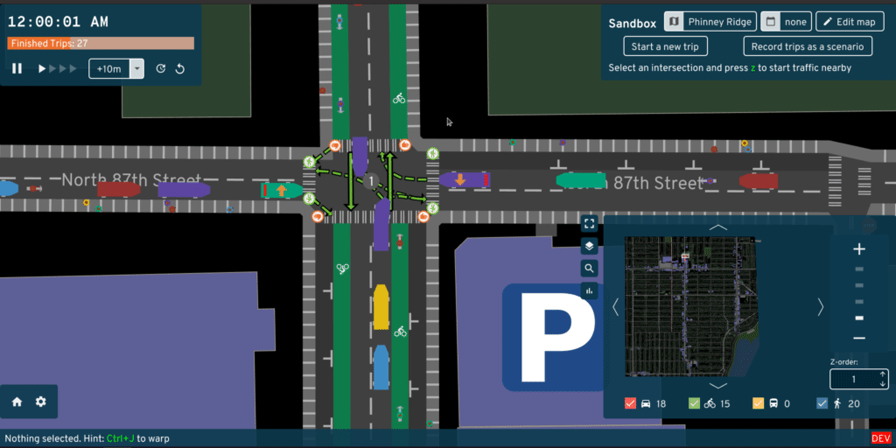

# UrbanInference
Applying inference techniques to city planning simulations

## Background

City and infrastructure design is only becoming more crucial as we as a society become more cognizant of its impact on climate change, public health, and racial and socio-economic equity. The ways in which the cities and towns we live in are built have a undervalued impact on our wellbeing as individuals and collectively [cite], and as such it is becoming more and more pertinent to understand how exactly we can build cities to be more beneficial instead of harmful.

However, a major impedance of this goal is the number of factors at play when considering how to design cities. Even the simplest town has countless attributes that must be considered: geographic topology and climate, industry in the surrounding area, class distribution of its residents, etc. [cite]. Furthermore, it is often not necessarily agreed upon on what we should be optimizing _for_ when designing a city [cite]: politically speaking, what is politically favorable may not be supported by the recommendations of urban planners. 

All in all, it can be of great value to understand more deeply how changes in a city's structure will impact its residents and resource use as a whole, and while there have been efforts to explore this, the broad nature of the field means there is always room to explore further.

todo: lit review of previous simulation/inference projects

As a result, we attempt to apply an inference technique originally developed by Papamakarios and Murray [cite] on A/B Street, a road/city planning simulation [cite], as a proof-of-concept application of simulation inference on city planning simulations to broadly learn the impacts of traffic and road design on the efficiency and resource use of a city;

## Method

[inference]

[ab street]

A/B Street is a city simulator developed by Dustin Carlino [cite] that supports map importing, people behavior patterns, traffic intersection and light dynamics, road structures, visualization, accessible metrics, and more. We chose A/B Street due to its ability to customize city features, its analysis metrics, and an API that links well with outside programs with or without the GUI.

Traffic Simulation run in A/B Street

Editing roads in the A/B Street GUI

Understanding simulation output

