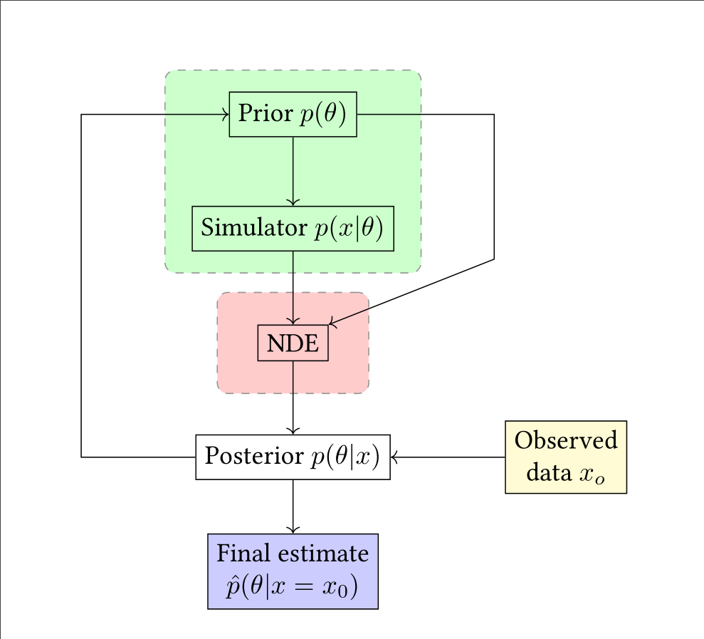

# Applying simulation inference to city planning tools
Samuel Griesemer\
email\
University of Southern California

Jared Hwang\
jaredhwa@usc.edu\
University of Southern California

## Abstract

The way cities are structured and designed can have a massive impact on 
everything ranging from human health, to climate change, to societal equity. 
Understanding the relationship between a city's features to these qualities 
is paramount to designing cities according to our goals as a society. 
Simulation-based inference is a method in which a simulator is described by 
a joint distribution over some output of a simulation and some latent variables, 
contitioned on some input. We thereby can attempt to learn the relationship between
the output and the input parameters. We apply this technique to A/B Street, a traffic
simulation tool, by investigating the impact of an intersection's structure on the
average trip time in the wider area. We find that.... We hope that these results 
show that simulation inference can be applied on the wider urban planning
field as a whole.

## Background

City and infrastructure design is only becoming more crucial as we as a
society become more cognizant of out impact on climate change, public
health, and racial and socio-economic equity. It is widely understood that 
the structural design of our cities have a marked impact on our wellbeing 
both individually and collectively, so it is therefore in our best interest 
to design and propose policy that actively strives towards "better" cities.

However, a major impedance of this goal is the number of conflating factors 
and differing goals (politically and technically) when considering optimal 
design. Each can have innumerable differences from another: their geographic 
topology, climate, socio-economic and race composition, historical features, 
and so on. 

As a result, a deeper understanding of a city's design on its residents, resource 
usage, and so on, is extremely desirable to motivate better policy and design 
recommendations, but correspondingly can be difficult to pin down. 

To approach this problem, we attempt to apply an inference technique
 developed by Papamakarios and Murray [[1]](#1) on A/B Street, a
road/city planning simulation [[2]](#2), as a proof-of-concept
application of simulation inference on city planning simulations to
broadly learn the impacts of traffic and road design on the efficiency
and resource use of a city.

## Method

### Simulation-based inference
Simulators are formally treated as probabilistic programs that take a vector of parameters
$\theta$ as input, internally sample a series of latent states $z_i \sim
p_i(z_i|\theta,z_{< i})$, and produce a data vector $x \sim p(x|\theta,z)$ as output. As
such, simulators can be described by the joint distribution $p(x,z|\theta)$ over the
output $x$ and latent variables $z$. This distribution captures the relative likelihoods
of $(x,z)$ pairs under fixed parameter values, embracing the relationship between $\theta$
and $z$ explicitly. Note that this can be written as the product 

$$p(x,z|\theta) = p(x|z,\theta)p(z|\theta)$$

Simulation-based inference diagram.

Sequential neural posterior estimation diagram

### Simulator: A/B Street

A/B Street is a city and traffic simulator developed by Dustin Carlino, 
built using the Open Street Map (OSM) format [[3]](#3). It is widely flexible and
supports importing any map through OSM, changing lane type (driving, bus, bike) 
and speed limits, traffic light timings, among others. It also has built in 
visualization, data aggregation, and an API through which we can control the 
simulation headlessly via Python code. We chose A/B Street due to these factors, 
contributing to its ease of using it as a black box for the simulation inference. 

Traffic Simulation run in A/B Street

Editing roads in the A/B Street GUI

Understanding simulation output

## Software Requirements

To run the code, download the A/B street repository (abstreet.org) and its 
requirements and follow the instructions there to start a server headlessly with the desired map.
Then, run the Python code provided in this repository.

Alternatively, use the provided Singularity environment definition file to build a container 
with the required packages, and simply run the headless Rust program in the A/B Street repository
to start the server, then run the Python code here. This is particularly useful for 
running the inference on a high-performance cluster for faster results, as we did using the University of Southern California Advanced Reserach Computing Cluster (CARC). NOTE: currently
 the Singularity container does not quite work out of the box, due to some permissions 
 errors that require extra work before and after building the container in order to have all the requisite software. This is a work in progress. 

## Expected Results

As discussed above, there are some traits of road structure that are already understood: for example, increasing number of lanes doesn't necessarily decrease trip times. Using simulation inference, we hope to gain deeper insight on the design of intersections and intra-city roads on overall travel time and throughput, which may be counter-intuitive to what we may expect.

## Results

## Future Goals

As stated above, we use A/B Street and road design as a preliminary
proof-of-concept on the application of simulation inference on city
design. However, there are many more ways we can utilize this technique
beyond just roads.

A burgeoning field is that of understanding city design on the emissions
produced by a city, and understanding how the block and road structure
impacts the city's contribution to climate change. Gim performed a global 
study of land-use on a various city's emissions, for example, congestion 
leading to longer trip times leading to greater emissions [[4]](#4).
By using a model and performing inference on it, we can potentially 
understanding how to more granularly change current cities or motivate 
future cities to reduce resource use and CO$_2$ emissions.

Relatedly is the concept of urban heat islands--when the city itself is
warmer than the surrounding areas, resulting in greater air-pollution,
heat-related illnesses. Understanding how building material and block
structure impacts this could be of massive benefit. Gober et al. explored this 
for Phoenix, Arizona, by modeling three different scenarios based on gathered 
data [[5]](#5). We could potentially use simulation 
inference on their model to more fundamentally understand the land-use and heat island 
relationship.

Another area of interest is how policy changes can influence land-use in certain 
areas, thereby influencing everything about the city itself--from emissions to all 
the other qualities discussed above. Landis investigated this using their California 
Urban Futures Model, where they simulated the results of three different scenarios: 
"business as usual", "Maximum Environmental Protection", and "Compact Cities" [[6]](#6).
 By applying inference on the model, perhaps we can obtain more optimal, fine grained 
 policy recommendations than just three scenarios would illuminate.

We've discussed several potential paths and application for this research moving 
forward, however, there are many more that can and should be investigated. Urban planning 
as a field is growing rapidly, and in turn, applications of computational techniques in 
the urban planning space are similarly growing. With the results we have presented here, 
we hope to have shown that the application of computational techniques developed for physics, 
math, and so on could have countless uses in urban planning, and could serve to 
benefit society as a whole. 

## References

<a id="1">[1]</a> 
K. Cranmer, J. Brehmer, and G. Louppe, “The frontier of simulation-based
inference,” Proceedings of the National Academy of Sciences, vol. 117, no. 48,
pp. 30055–30062, 2020.

<a id="2">[2]</a> 
D. Carlino, “A/B Street,” June 2018. Accessed on: Dec. 12, 2021. [Online] Available: https://abstreet.org

<a id="3">[3]</a> 
M. Haklay and P. Weber, “Openstreetmap: User-generated street maps,”
IEEE Pervasive Computing, vol. 7, no. 4, pp. 12–18, 2008.

<a id="4">[4]</a> 
T.-H. T. Gim, “Analyzing the city-level effects of land use on travel time
and co2 emissions: a global mediation study of travel time,” International
Journal of Sustainable Transportation, vol. 0, no. 0, pp. 1–18, 2021.

<a id="5">[5]</a> 
P. Gober, A. Brazel, R. Quay, S. Myint, S. Grossman-Clarke, A. Miller, and
S. Rossi, “Using watered landscapes to manipulate urban heat island effects:
How much water will it take to cool phoenix?,” Journal of the American
Planning Association, vol. 76, no. 1, pp. 109–121, 2009.

<a id="6">[6]</a> 
J. D. Landis, “Imagining land use futures: Applying the california urban
futures model,” Journal of the American Planning Association, vol. 61, no. 4,
pp. 438–457, 1995.
