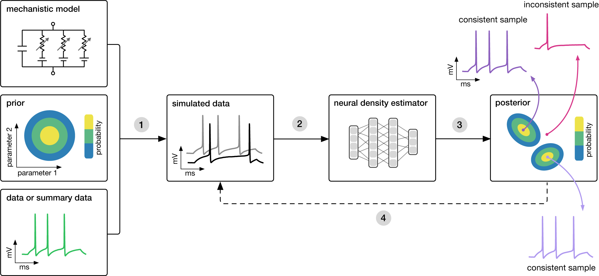

# UrbanInference
Applying inference techniques to city planning simulations

## Background

City and infrastructure design is only becoming more crucial as we as a society become more cognizant of its impact on climate change, public health, and racial and socio-economic equity. The ways in which the cities and towns we live in are built have a undervalued impact on our wellbeing as individuals and collectively [cite], and as such it is becoming more and more pertinent to understand how exactly we can build cities to be more beneficial instead of harmful.

However, a major impedance of this goal is the number of factors at play when considering how to design cities. Even the simplest town has countless attributes that must be considered: geographic topology and climate, industry in the surrounding area, class distribution of its residents, etc. [cite]. Furthermore, it is often not necessarily agreed upon on what we should be optimizing _for_ when designing a city [cite]: politically speaking, what is politically favorable may not be supported by the recommendations of urban planners. 

All in all, it can be of great value to understand more deeply how changes in a city's structure will impact its residents and resource use as a whole, and while there have been efforts to explore this, the broad nature of the field means there is always room to explore further.

todo: lit review of previous simulation/inference projects

As a result, we attempt to apply an inference technique originally developed by Papamakarios and Murray [cite] on A/B Street, a road/city planning simulation [cite], as a proof-of-concept application of simulation inference on city planning simulations to broadly learn the impacts of traffic and road design on the efficiency and resource use of a city;

## Method

### Simulation-based inference
Simulators are formally treated as probabilistic programs that take a vector of parameters
$\theta$ as input, internally sample a series of latent states $z_i \sim
p_i(z_i|\theta,z_{< i})$, and produce a data vector $x \sim p(x|\theta,z)$ as output. As
such, simulators can be described by the joint distribution $p(x,z|\theta)$ over the
output $x$ and latent variables $z$. This distribution captures the relative likelihoods
of $(x,z)$ pairs under fixed parameter values, embracing the relationship between $\theta$
and $z$ explicitly. Note that this can be written as the product 

$$p(x,z|\theta) = p(x|z,\theta)p(z|\theta)$$

Simulation-based inference diagram.

Sequential neural posterior estimation diagram

### Simulator: A/B Street

A/B Street is a city simulator developed by Dustin Carlino [cite] that supports map importing, people behavior patterns, traffic intersection and light dynamics, road structures, visualization, accessible metrics, and more. We chose A/B Street due to its ability to customize city features, its analysis metrics, and an API that links well with outside programs with or without the GUI.

Traffic Simulation run in A/B Street

Editing roads in the A/B Street GUI

Understanding simulation output

We plan to write an inference package that run and accept output from the A/B street simulations and understanding the underlying posterior of road structure on city and travel efficiency.

## Expected Results

As discussed above, there are some traits of road structure that are already understood: for example, increasing number of lanes doesn't necessarily decrease trip times. Using simulation inference, we hope to gain deeper insight on the design of intersections and intra-city roads on overall travel time and throughput, which may be counter-intuitive to what we may expect.

## Future Goals

As stated above, we use A/B Street and road design as a preliminary proof-of-concept on the application of simulation inference on city design. However, there are many more ways we can utilize this technique beyond just roads.

A burgeoning field is that of understanding city design on the emissions produced by a city, and understanding how the block and road structure impacts the city's contribution to climate change. [cite]

Relatedly is the concept of urban heat islands--when the city itself is warmer than the surrounding areas, resulting in greater air-pollution, heat-related illnesses. Understanding how building material and block structure impacts this could be of massive benefit [cite].

Similarly, what kind of land-use patterns decrease storm-water runoff and susceptibility to climate-change related weather patterns [cite]. Additionally, how does the density and land-use patterns of a city impact it's emissions, and in turn, how do we minimize emissions while not adversely impacting livability and equity? [cite]

Urban planning as a field is growing rapidly, and in turn, the applications of simulation and computational techniques are growing rapidly. Techniques previously used in physics, astronomy, and so on could easily be applied to urban planning feld to the benefit of society as a whole, which is what we hope to have shown here.

